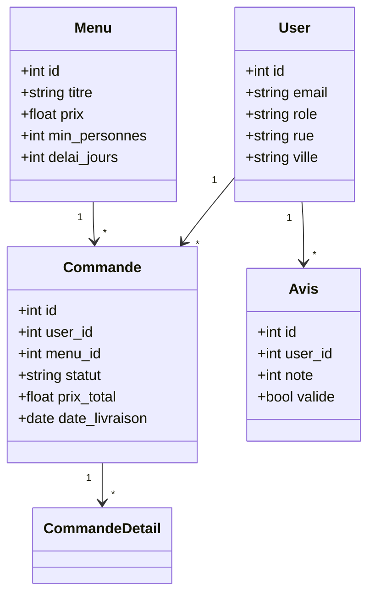
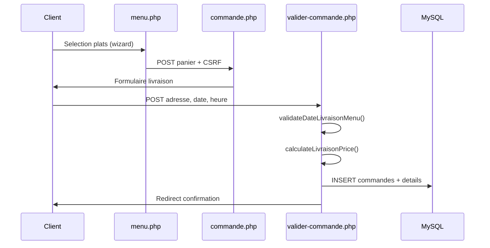
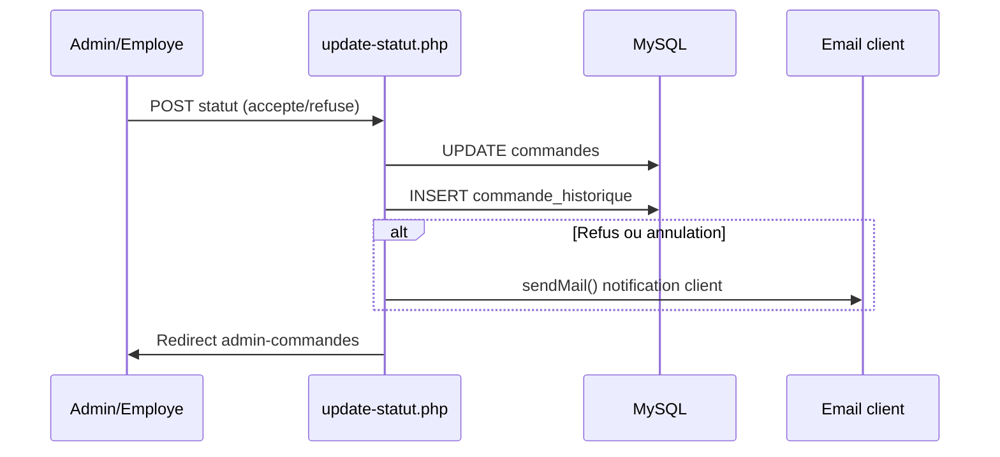

# Documentation technique — Vite & Gourmand

## Architecture

- **Front** : PHP + Bootstrap 5 + JavaScript (filtres AJAX, wizard menu)
- **Back** : PHP 8.2+, PDO, sessions
- **BDD relationnelle** : MySQL (commandes, users, menus, avis)
- **NoSQL** : MongoDB (statistiques CA — local ; fallback MySQL en production)
- **Deploiement** : XAMPP (dev) / InfinityFree (prod)

## Structure

```
/                 Site public (index, menus, commande, espace client)
/admin/           Back-office admin et employe
/includes/        db.php, auth.php, helpers.php, menu-helpers.php
/database/        schema.sql, migrations
/docs/            Livrables ECF (MD → PDF)
```

## Base MySQL — tables principales

| Table | Role |
|-------|------|
| users | Clients, employes, admins (adresse structuree) |
| menus / plats / menu_options | Catalogue et composition menus |
| commandes | Commandes (adresse livraison, prix, statut) |
| commande_details | Choix plats par commande |
| commande_boissons | Boissons additionnelles |
| commande_historique | Timeline statuts + trace staff |
| avis | Avis moderes (validation admin) |
| password_resets | Reinitialisation mot de passe |

## Roles et acces

| Role | Acces |
|------|-------|
| utilisateur | Commande, espace client, avis |
| employe | Back-office operationnel (sans CA financier) |
| admin | Gestion complete (users, menus, stats CA) |

Controle via `includes/auth.php` : `requireAdminAccess()`, `canViewAdminFinancials()`, `isEmploye()`.

## Regles metier (helpers)

Fichier `includes/helpers.php` :

- `getDateMinLivraison($delaiJours)` — date minimum livraison
- `validateDateLivraisonMenu()` — validation serveur delai
- `calculateLivraisonPrice($ville, $cp)` — 5 € + 0,59 €/km (zones CP)
- `calculateCommandeReduction()` — -10 % si >= 10 % au-dessus du minimum personnes
- `enregistrerHistorique()` — journal statuts commande

## Diagramme de classes (simplifie)



## Diagramme de sequence — Passer une commande



## Diagramme de sequence — Validation admin



## Securite

- Requetes preparees PDO (anti-injection SQL)
- Tokens CSRF sur inscription, commande, admin
- `password_hash()` / `password_verify()` (bcrypt)
- Validation mot de passe : 10 car., majuscule, minuscule, chiffre, special
- Sessions separees site public / admin
- `requireAdminAccess(true)` pour gestion utilisateurs (admin seul)

## MongoDB

- Collection `commandes_stats` (CA par mois)
- Sync via `scripts/sync-mongo.php`
- **Production InfinityFree** : pas d'extension MongoDB → dashboard utilise requetes MySQL

## Deploiement

| Environnement | URL / outil |
|---------------|-------------|
| Local | XAMPP — http://localhost/vite-gourmand/ |
| Production | InfinityFree — https://vitegourmand.infinityfree.io/ |

Variables : `DB_HOST`, `DB_NAME`, `DB_USER`, `DB_PASS` dans `includes/config.php` ou `.env`.

Upload prod : FileZilla (eviter BOM UTF-8 du File Manager).

Migrations a appliquer si necessaire :
- `database/migration.sql`
- `database/migration-user-space.sql`
- `database/patch-regimes-boissons.sql`

## Fichiers cles recents

| Fichier | Role |
|---------|------|
| modifier-commande.php | Modification client (hors menu) + validation delai |
| cgv.php | Conditions generales completes |
| admin/partials/dashboard-employee.php | Dashboard employe sans CA |
| admin/annuler-commande.php | Annulation avec contact obligatoire |
