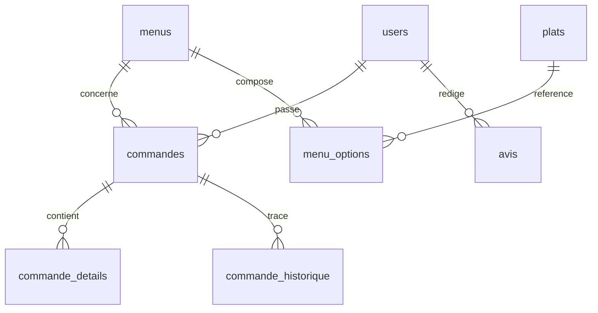

# Dossier Projet — Projets réalisés pendant la formation

> **Candidat :** Océane Virginie Erica Duffour  
> **Formation :** Développeur Web et Web Mobile (Studi)  
> **Projet principal :** Vite & Gourmand — traiteur en ligne  
> **Période :** Février — Juillet 2026  
> **Production :** https://vitegourmand.infinityfree.io/  
> **GitHub :** https://github.com/Oceduff21/vite-gourmand  

---

## Sommaire

1. [Liste des compétences mises en œuvre](#1-liste-des-compétences-mises-en-œuvre)
2. [Expression des besoins, objectifs et limites](#2-expression-des-besoins-objectifs-et-limites)
3. [Environnement technique](#3-environnement-technique)
4. [Réalisations et mise en œuvre des compétences](#4-réalisations-et-mise-en-œuvre-des-compétences)
5. [Annexes](#5-annexes)

---

## 1. Liste des compétences mises en œuvre

Le référentiel **TP Développeur Web et Web Mobile** impose la couverture de deux activités types. Le projet *Vite & Gourmand* les adresse intégralement.

### Activité type 1 — Front-end sécurisé

| Compétence référentiel | Mise en œuvre dans le projet | Preuves |
|------------------------|------------------------------|---------|
| **Maquetter des interfaces** | Wireframes desktop/mobile (accueil, menus, wizard commande) ; charte graphique (#c0392b, Bootstrap 5) | `docs/CHARTE_GRAPHIQUE.pdf`, section 4.1 |
| **Réaliser des interfaces statiques** | Pages HTML sémantiques + Bootstrap : accueil, menus, CGV, accessibilité, mentions légales | `index.php`, `menus.php`, `accessibilite.php`, `assets/css/style.css` |
| **Développer la partie dynamique** | Wizard menu multi-étapes (JS), filtres AJAX menus, carousel hero, modales avis, graphiques admin Chart.js | `menu.php`, `load-menus.php`, `assets/js/modifier-plats.js`, `admin/dashboard.php` |

### Activité type 2 — Back-end sécurisé

| Compétence référentiel | Mise en œuvre dans le projet | Preuves |
|------------------------|------------------------------|---------|
| **Mettre en place une BDD relationnelle** | Schéma MySQL normalisé (users, menus, plats, commandes, avis, historique) ; migrations versionnées | `database/schema.sql`, `database/migration.sql`, section 4.2 |
| **Composants d'accès aux données SQL et NoSQL** | PDO préparé (MySQL) ; sync MongoDB pour stats CA en local ; fallback MySQL en production | `includes/db.php`, `includes/mongo.php`, `scripts/sync-mongo.php` |
| **Composants métier côté serveur** | Validation délais livraison, calcul prix livraison/réduction, workflow statuts commande, modération avis, rôles admin/employé/client | `includes/helpers.php`, `includes/menu-helpers.php`, `valider-commande.php`, `admin/update-statut.php` |

### Compétences transverses mobilisées

- **Sécurité** : CSRF, bcrypt, requêtes préparées, contrôle d'accès par rôle
- **Accessibilité (RGAA)** : labels formulaires, navigation clavier, page `accessibilite.php`, audit WAVE
- **RGPD** : politique de confidentialité, bandeau cookies, droits utilisateur
- **Gestion de projet** : Trello, Git/GitHub, déploiement itératif
- **Veille sécurité** : OWASP (XSS, injection SQL, CSRF), bonnes pratiques PHP 8

---

## 2. Expression des besoins, objectifs et limites

### 2.1 Contexte

**Vite & Gourmand** est une entreprise fictive de traiteur événementiel à Bordeaux. Le projet répond au **cahier des charges ECF** : concevoir une application web permettant aux clients de consulter des menus thématiques, composer une commande sur mesure et suivre leur prestation ; aux employés et administrateurs de gérer commandes, catalogue et avis.

### 2.2 Expression des besoins (besoins fonctionnels)

| Id | Besoin | Priorité |
|----|--------|----------|
| BF1 | Consulter le catalogue de menus avec filtres (thème, régime, budget, personnes) | Haute |
| BF2 | Composer une commande (entrées/plats/desserts, boissons, enfants) via un assistant pas à pas | Haute |
| BF3 | S'inscrire / se connecter avec adresse structurée (rue, CP, ville) | Haute |
| BF4 | Valider une commande avec date de livraison respectant le délai minimum du menu | Haute |
| BF5 | Suivre l'historique et le statut des commandes (espace client) | Haute |
| BF6 | Back-office admin : CRUD menus/plats, gestion utilisateurs, statistiques CA | Haute |
| BF7 | Back-office employé : gestion opérationnelle des commandes et avis (sans accès financier complet) | Moyenne |
| BF8 | Déposer et modérer des avis clients | Moyenne |
| BF9 | Pages légales (CGV, RGPD, accessibilité) | Moyenne |
| BF10 | Statistiques NoSQL (MongoDB) en environnement local | Moyenne |

### 2.3 Besoins non fonctionnels

- **Responsive** : consultation mobile et desktop (Bootstrap 5)
- **Sécurité** : authentification, hashage mots de passe, protection CSRF, PDO
- **Accessibilité** : conformité RGAA visée ~90 % (audit WAVE)
- **Performance** : filtres menus en AJAX sans rechargement complet
- **Maintenabilité** : code modulaire (`includes/`), dépôt Git public
- **Déploiement** : hébergement gratuit PHP/MySQL (InfinityFree)

### 2.4 Objectifs du projet

1. Livrer une **application fonctionnelle en production** accessible en ligne
2. Couvrir l'**intégralité du référentiel** front-end et back-end du TP
3. Documenter le projet (manuel, charte, doc technique, dossier ECF)
4. Préparer une **soutenance orale** devant jury avec démonstration live

### 2.5 Limites et périmètre exclu

| Limite | Justification |
|--------|---------------|
| Pas de paiement en ligne réel | Hors périmètre ECF ; facturation décrite en CGV |
| MongoDB non disponible en production | Contrainte hébergeur gratuit → fallback MySQL pour le dashboard |
| Pas d'application mobile native | Périmètre web responsive uniquement |
| Messagerie e-mail dépendante de l'hébergeur | Envoi conditionné à la config SMTP InfinityFree |
| Catalogue alimenté manuellement | Pas d'interface fournisseur externe |
| Audit RGAA non certificateur | Audit interne + WAVE, pas d'audit officiel 106 critères |

---

## 3. Environnement technique

### 3.1 Stack applicative

| Couche | Technologies |
|--------|--------------|
| Front-end | HTML5, CSS3, JavaScript ES6+, Bootstrap 5.3, Chart.js, Font Awesome |
| Back-end | PHP 8.3, sessions PHP, architecture MVC légère (pages + includes) |
| BDD relationnelle | MySQL 8 (InnoDB, UTF-8) |
| BDD NoSQL | MongoDB (stats admin — local Docker/XAMPP) |
| Serveur local | XAMPP (Apache + MySQL + PHP) |
| Production | InfinityFree — https://vitegourmand.infinityfree.io/ |
| Versionning | Git, GitHub (branche `main`) |
| IDE | Cursor / Visual Studio Code |
| Outils | FileZilla (FTP), phpMyAdmin, extension WAVE (accessibilité) |

### 3.2 Architecture logicielle

```
vite-gourmand/
├── index.php, menus.php, menu.php, commande.php   # Site public
├── espace-utilisateur.php, login.php, register.php
├── admin/                                          # Back-office
├── includes/                                       # db, auth, helpers, menu-helpers
├── assets/css/, assets/js/, assets/images/
├── database/                                       # Schémas et migrations SQL
└── docs/                                           # Livrables
```

### 3.3 Environnements

| Environnement | URL | Rôle |
|---------------|-----|------|
| Développement | `http://localhost/vite-gourmand/` | Développement, tests, MongoDB |
| Production | `https://vitegourmand.infinityfree.io/` | Démonstration jury, tests ECF |

Configuration production : `includes/config.local.php` (non versionné) avec identifiants InfinityFree.

### 3.4 Comptes de démonstration (production)

| Rôle | E-mail | Mot de passe |
|------|--------|--------------|
| Administrateur | jose@vite-gourmand.fr | Admin123! |
| Employée | julie@vite-gourmand.fr | Employe123! |
| Client | client@vite-gourmand.fr | Client123! |

---

## 4. Réalisations et mise en œuvre des compétences

### 4.1 Front-end — Maquettes et interfaces

#### Maquettes (compétence : maquetter)

Des wireframes fil de l'eau ont été produits avant développement :

- **Desktop** : accueil (hero + cartes menus), liste menus avec filtres, fiche menu avec wizard
- **Mobile** : navigation hamburger, cartes empilées, wizard en étapes verticales

**Enchaînement des écrans (parcours client) :**

```
Accueil → Menus (filtres) → Fiche menu (wizard 6 étapes) → Connexion/Inscription
    → Formulaire livraison → Confirmation → Mon espace → Suivi commande → Avis
```

**Enchaînement back-office :**

```
Admin login → Dashboard (KPI + graphiques) → Commandes (filtres + statuts)
    → Détail commande → Modération avis → Gestion menus/plats (admin seul)
```

Charte appliquée : rouge bordeaux `#c0392b`, or `#c9a227`, fond `#1a1a2e`, typographie Segoe UI / Bootstrap.

> **Annexe A :** `docs/CHARTE_GRAPHIQUE.pdf` (wireframes + couleurs)  
> **Annexe B :** captures écran prod — *voir liste en fin de document*

#### Interfaces statiques (compétence : réaliser des interfaces statiques)

Exemple — structure sémantique et skip link RGAA dans l'en-tête :

```php
// includes/header.php (extrait)
<body>
<a class="visually-hidden-focusable skip-link" href="#main-content">
    Aller au contenu principal
</a>
<nav class="navbar custom-navbar" aria-label="Navigation principale">
```

Page accessibilité dédiée (`accessibilite.php`) documentant les mesures RGAA pour le jury.

**Choix d'intégration :** Bootstrap 5 pour accélérer le responsive ; CSS custom limité aux composants métier (cartes menus, wizard, badges régime alimentaire) afin de conserver la charte sans surcharger le CSS.

**Extrait CSS — cartes menus :**

```css
.menu-card {
    border-radius: 16px;
    box-shadow: 0 4px 12px rgba(0, 0, 0, 0.08);
    transition: transform 0.2s ease;
}
.menu-card:hover {
    transform: translateY(-4px);
}
```

#### Interfaces dynamiques (compétence : développer la partie dynamique)

**Filtres menus AJAX** — le client filtre sans recharger la page :

- Front : `menus.php` + JavaScript fetch vers `load-menus.php`
- Logique métier de filtrage sémantique (OR entre thème/régime/recherche) :

```php
// includes/menu-helpers.php (extrait)
function filterMenusForListing(array $menus, array $params): array
{
    $criteria = collectMenuSemanticCriteria($params);
    // ...
    return array_values(array_filter($menus, static function (array $menu) use ($criteria, ...): bool {
        foreach ($criteria as $criterion) {
            if (menuMatchesSemanticCriterion($menu, $criterion)) {
                return true;
            }
        }
        return false;
    }));
}
```

**Wizard de commande** (`menu.php`) — assistant en 6 étapes :

1. Nombre d'invités  
2. Entrées (répartition par plat)  
3. Plats  
4. Desserts  
5. Boissons (optionnel)  
6. Récapitulatif → redirection vers `commande.php`

JavaScript gère la navigation entre étapes, le compteur d'invites restants et l'accessibilité (ARIA, focus). Validation côté serveur en complément.

**Arguments de choix — wizard :** un formulaire monolithique serait illisible pour 3 entrées × 3 plats × 3 desserts ; l'assistant guide l'utilisateur et réduit les erreurs de répartition des convives.

**Extrait JavaScript — navigation étapes (concept) :**

```javascript
function goToStep(stepIndex) {
    document.querySelectorAll('.wizard-step').forEach(el => el.hidden = true);
    document.getElementById('step-' + stepIndex).hidden = false;
    document.getElementById('step-' + stepIndex).focus();
}
```

**Dashboard admin** — graphiques Chart.js alimentés par requêtes PHP, avec alternative textuelle (tableau de données) pour l'accessibilité.

---

### 4.2 Back-end — Base de données et composants

#### Schéma relationnel (compétence : mettre en place une BDD)

Modèle entité-relation principal :



Tables clés : `users` (rôle : client/employé/admin), `menus`, `plats`, `menu_options`, `commandes`, `commande_details`, `commande_boissons`, `commande_historique`, `avis`.

Script de création : `database/schema.sql` et migrations incrémentales (`database/migration.sql`, patches).

#### Composants d'accès aux données (compétence : SQL et NoSQL)

**MySQL — connexion PDO centralisée :**

```php
// includes/db.php (extrait)
$pdo = new PDO(
    "mysql:host=$host;dbname=$dbname;charset=utf8",
    $user,
    $password,
    [
        PDO::ATTR_ERRMODE => PDO::ERRMODE_EXCEPTION,
        PDO::ATTR_DEFAULT_FETCH_MODE => PDO::FETCH_ASSOC
    ]
);
```

**Exemple requête préparée — plats d'un menu :**

```php
// includes/menu-helpers.php (extrait)
$stmt = $pdo->prepare('
    SELECT mo.type, p.*
    FROM menu_options mo
    JOIN plats p ON p.id = mo.plat_id
    WHERE mo.menu_id = ?
    ORDER BY mo.type, p.nom
');
$stmt->execute([$menuId]);
```

**MongoDB — synchronisation stats (local) :**

```php
// scripts/sync-mongo.php (extrait)
$rows = $pdo->query('SELECT c.id, c.menu_id, m.titre, c.prix_total ... FROM commandes c ...')->fetchAll();
foreach ($rows as $r) {
    mongoInsertCommandeStat([...]);
}
```

En production, le dashboard utilise des agrégations MySQL équivalentes (hébergeur sans MongoDB).

#### Composants métier (compétence : logique serveur)

**Validation date de livraison** — règle métier CDC :

```php
function validateDateLivraisonMenu(string $dateLivraison, int $delaiJours, ?string $fromDate = null): ?string
{
    if ($dateLivraison === '') {
        return 'Date de livraison obligatoire.';
    }
    $delai = analyseDelaiLivraison($dateLivraison, $delaiJours, $fromDate);
    if (!$delai['delai_respecte']) {
        return 'Delai insuffisant : livraison possible a partir du ' . $delai['date_min_livraison'];
    }
    return null;
}
```

**Calcul tarifaire** :

- `calculateLivraisonPrice($ville, $cp)` — 5 € + 0,59 €/km selon zone
- `calculateCommandeReduction()` — −10 % si effectif ≥ 10 % au-dessus du minimum menu

**Workflow commande** — 8 statuts gérés par `admin/update-statut.php` avec historique (`enregistrerHistorique()`) et notification e-mail client en cas de refus/annulation.

**Contrôle d'accès** :

```php
// admin/partials/auth.php
function requireAdminAccess(bool $adminOnly = false): void
{
    if (!isset($_SESSION['user_id']) || !isAdminUser()) {
        header('Location: login.php');
        exit();
    }
    if ($adminOnly && !isSuperAdmin()) {
        http_response_code(403);
        die('Acces reserve aux administrateurs.');
    }
}
```

**Inscription client sécurisée** (`register.php`) : validation mot de passe (10 car., majuscule, chiffre, spécial), hash bcrypt, CSRF :

```php
if (!verifyCsrf($_POST['csrf_token'] ?? '')) { die('Token CSRF invalide.'); }
$hash = password_hash($password, PASSWORD_DEFAULT);
$stmt = $pdo->prepare('INSERT INTO users (...) VALUES (?, ?, ..., ?)');
$stmt->execute([..., $hash, 'utilisateur']);
```

---

### 4.3 Sécurité de l'application

| Menace | Mesure implémentée | Fichiers |
|--------|-------------------|----------|
| Injection SQL | Requêtes PDO préparées exclusivement | `includes/db.php`, tous les `prepare()` |
| XSS | `htmlspecialchars()` à l'affichage | Templates PHP |
| CSRF | Token session + `verifyCsrf()` sur POST | `includes/helpers.php`, formulaires |
| Mots de passe | `password_hash()` / `password_verify()` bcrypt | `register.php`, `login.php` |
| Élévation de privilèges | Rôles `admin` / `employe` / `utilisateur` | `admin/partials/auth.php` |
| Sessions | Sessions séparées site / admin ; destruction au logout | `logout.php` |

Exemple CSRF :

```php
// includes/helpers.php
function csrfToken(): string {
    if (empty($_SESSION['csrf_token'])) {
        $_SESSION['csrf_token'] = bin2hex(random_bytes(32));
    }
    return $_SESSION['csrf_token'];
}
```

---

### 4.4 Jeu d'essai — Fonctionnalité représentative (commande Menu Entreprise)

**Fonctionnalité choisie :** parcours complet de commande du *Menu Entreprise* (id=14) — la plus représentative (wizard, minimum personnes, prix, validation délai).

| Étape | Donnée en entrée | Résultat attendu | Résultat obtenu |
|-------|------------------|------------------|-----------------|
| 1 | 10 adultes, 0 enfant | Total invites = 10, prix base affiché | OK — 34 €/pers. |
| 2 | 3 entrées réparties (ex. 4+3+3) | Somme = 10 | OK |
| 3 | 3 plats répartis | Somme = 10 | OK |
| 4 | 3 desserts répartis | Somme = 10 | OK |
| 5 | Date livraison J+5 ouvrés | Acceptée si ≥ delai menu | OK (validation serveur) |
| 6 | Connexion client + validation | Commande en BDD, statut `en_attente` | OK |
| 7 | Admin accepte commande | Statut `acceptee`, historique tracé | OK |

**Écart identifié :** sur hébergement gratuit, l'e-mail de confirmation peut ne pas partir si SMTP non configuré — comportement documenté, non bloquant pour la démo.

---

### 4.5 Veille sécurité

Pendant le projet, veille effectuée sur :

- **OWASP Top 10** (2021) : injection, XSS, CSRF, authentification
- **Documentation PHP** : `password_hash`, sessions sécurisées, PDO
- **CNIL / RGPD** : cookies, politique de confidentialité
- **RGAA** : référentiel accessibilité, outil WAVE

**Vulnérabilité corrigée :** absence initiale de token CSRF sur certains formulaires admin → ajout systématique de `csrfField()` / `verifyCsrf()`.

**Point de vigilance :** fichiers PHP encodés UTF-16 lors d'un upload — correction via `scripts/fix-php-encoding.ps1` avant déploiement (affichage code source en prod).

---

## 5. Annexes

Les annexes (30 pages max.) complètent les extraits ci-dessus :

| Annexe | Contenu | Fichier / statut |
|--------|---------|------------------|
| A | Maquettes et charte graphique | `docs/CHARTE_GRAPHIQUE.pdf` ✓ |
| B | Captures écran site (desktop + mobile) | **À FOURNIR par le candidat** |
| C | Captures WAVE / accessibilité | **À FOURNIR par le candidat** |
| D | Schéma BDD complet | `database/schema.sql` ✓ |
| E | Manuel utilisateur | `docs/MANUEL_UTILISATEUR.pdf` ✓ |
| F | Documentation technique | `docs/DOCUMENTATION_TECHNIQUE.pdf` ✓ |
| G | Extraits code significatifs | Sections 4.1 à 4.3 de ce dossier ✓ |

### Captures à réaliser (Annexe B)

1. Accueil — https://vitegourmand.infinityfree.io/
2. Menus + filtres — `/menus.php`
3. Wizard — `/menu.php?id=14`
4. Espace client — `/espace-utilisateur.php`
5. Dashboard admin — `/admin/login.php` (Jose)
6. Vue mobile 375 px (F12 navigateur)

Nommer les fichiers : `capture-01-accueil.png`, etc., dans `dossier-projet/annexes/captures/`.

---

*Dossier projet — Océane Virginie Erica Duffour — Studi — Juillet 2026*
